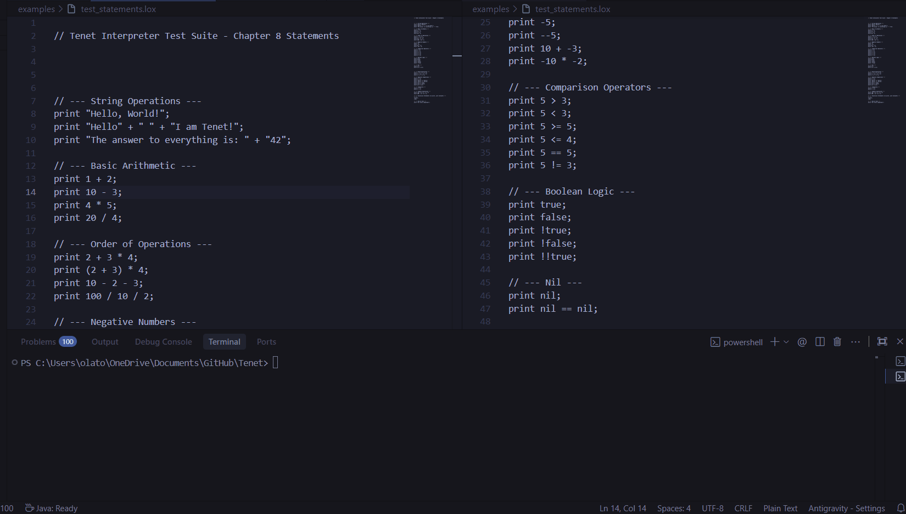
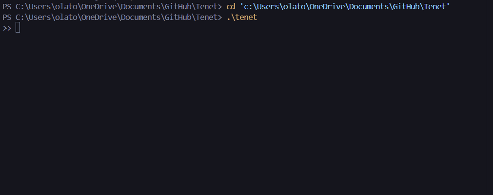

# Tenet

> A domain-specific language for game theory modeling, analysis, and simulation.

[]()
[]()
[]()

---

## Demo

### 3D Ray Tracer


*ASCII ray-traced 3D sphere rendered in real-time using custom math functions*

### Recursive Fibonacci


*Tenet computing the Fibonacci sequence using recursive functions and closures*

### Statements & Expressions


*Tenet interpreter executing print statements, arithmetic operations, boolean logic, and string concatenation*

### REPL Mode


*The Tenet interpreter evaluating expressions in the REPL*

---

## What is Tenet?

Tenet is a programming language designed for **game theorists, economists, and researchers** who want to model strategic interactions without becoming expert programmers.

```tenet
game PrisonersDilemma {
  players Alice, Bob
  strategies Cooperate, Defect

  payoff Alice {
    (Cooperate, Cooperate): 3
    (Cooperate, Defect): 0
    (Defect, Cooperate): 5
    (Defect, Defect): 1
  }
  
  payoff Bob {
    (Cooperate, Cooperate): 3
    (Defect, Cooperate): 0
    (Cooperate, Defect): 5
    (Defect, Defect): 1
  }
}

solve PrisonersDilemma;
// Output: Game analysis with Nash equilibrium (coming soon)
```

## Features

| Feature | Description |
|---|---|
| **Clean Syntax** | Minimalist, readable syntax—no boilerplate |
| **Game Definitions** | Define players, strategies, and payoff matrices naturally |
| **Full Language** | Functions, classes, loops—a complete programming language |
| **Economic Models** | 12+ pre-built models from microeconomics to political science |

---

## 🏛️ Model Library

Tenet comes with a library of standard game-theoretic models, proving its capability to handle complex incentive structures:

| Category | Models | Folder |
|----------|--------|--------|
| **Industrial Organization** | Cournot Duopoly, Bertrand Competition, Entry Deterrence | `examples/industrial_org/` |
| **Behavioral Economics** | Ultimatum Game, Trust Game, Stag Hunt, Chicken | `examples/behavioral/` |
| **Political Economy** | Tragedy of Commons, Public Goods, Arms Race | `examples/political_economy/` |
| **Classic Games** | Prisoner's Dilemma, Matching Pennies, Battle of Sexes | `examples/classic_games/` |

**[📖 View the full Model Gallery →](GALLERY.md)**

### Example: Cournot Duopoly

```tenet
// Two firms compete on quantity
var max_price = 100;
var unit_cost = 10;

game CournotDuopoly {
    players Firm1, Firm2
    strategies Low, High
    
    payoff Firm1 {
        (Low, Low): 900    // Price high, profits high
        (Low, High): 450   // They flood market, I suffer
        (High, Low): 675   // I flood market, I gain short-term
        (High, High): 0    // Price crashes, nobody profits
    }
    // ... (see examples/industrial_org/cournot_duopoly.tenet)
}

solve CournotDuopoly;
```


## Installation

```bash
# Clone the repository
git clone https://github.com/yourusername/tenet.git
cd tenet

# Compile
javac -d out src/org/axiom/tenet/*.java

# Run REPL (Windows)
.\tenet

# Run REPL (Alternative)
java -cp out org.axiom.tenet.Tenet

# Run a file
.\tenet examples/demo.tenet
```

## Roadmap

- [x] Lexer/Scanner
- [x] Expression Parser
- [x] Expression Interpreter
- [x] Statements & Print
- [x] Variables & State
- [x] Control Flow (if/else, while, for)
- [x] Functions & Closures
- [x] Resolving & Binding
- [x] Classes
- [x] Inheritance
- [x] **Game Definitions** 
- [x] **Solve Statement** 
- [ ] Nash Equilibrium Solver (pure strategies)
- [ ] Nash Equilibrium Solver (mixed strategies)
- [ ] Simulation Engine
- [ ] Standard Library (common games & strategies)

---

## Design Philosophy

**Why a language instead of a Python library?**

Libraries like `nashpy` or `gambit` are powerful, but they require users to think like programmers first and game theorists second. Tenet inverts this:

| Approach | Focus | Error Handling |
|---|---|---|
| Python + Library | "How do I structure this data?" | Runtime crashes |
| **Tenet** | "How do I model this game?" | Compile-time validation |

By making game theory a **first-class citizen** of the language, we can:
1. **Catch errors early** — Invalid payoff matrices are syntax errors, not runtime bugs
2. **Optimize simulations** — The compiler knows the game structure and can optimize
3. **Enforce correctness** — You can't accidentally create a game with mismatched strategies

---

## Language Specification

Tenet uses a context-free grammar. This is the formal specification the parser implements:

```ebnf
program     ::= declaration* EOF ;
declaration ::= gameDecl | strategyDecl | statement ;

// Game Definitions
gameDecl    ::= "game" IDENTIFIER gameBody ;
gameBody    ::= INDENT ( playersDecl | strategiesDecl | payoffDecl )* DEDENT ;
playersDecl ::= "players" IDENTIFIER ( "," IDENTIFIER )* NEWLINE ;
strategiesDecl ::= "strategies" IDENTIFIER ( "," IDENTIFIER )* NEWLINE ;
payoffDecl  ::= "payoff" IDENTIFIER INDENT payoffRule* DEDENT ;
payoffRule  ::= "(" IDENTIFIER "," IDENTIFIER ")" "->" NUMBER NEWLINE ;

// Strategy Definitions
strategyDecl ::= "strategy" IDENTIFIER INDENT statement* DEDENT ;

// Statements
statement   ::= solveStmt | simulateStmt | ifStmt | returnStmt | exprStmt ;
solveStmt   ::= "solve" IDENTIFIER NEWLINE ;
simulateStmt ::= "simulate" IDENTIFIER simulateBody ;
simulateBody ::= INDENT playerAssign* roundsDecl? DEDENT ;
playerAssign ::= IDENTIFIER "uses" IDENTIFIER NEWLINE ;
roundsDecl  ::= "rounds" NUMBER NEWLINE ;

// Expressions (standard precedence)
expression  ::= equality ;
equality    ::= comparison ( ( "==" | "!=" ) comparison )* ;
comparison  ::= term ( ( "<" | "<=" | ">" | ">=" ) term )* ;
term        ::= factor ( ( "+" | "-" ) factor )* ;
factor      ::= unary ( ( "*" | "/" ) unary )* ;
unary       ::= ( "!" | "-" ) unary | primary ;
primary     ::= NUMBER | STRING | "true" | "false" | "nil" 
              | IDENTIFIER | "(" expression ")" 
              | "history" "." IDENTIFIER ;
```

---

## Architecture

```
┌──────────────────────────────────────────────────────────────┐
│                        Source Code                           │
│            game PrisonersDilemma ...                         │
└──────────────────────────────────────────────────────────────┘
                              │
                              ▼
┌──────────────────────────────────────────────────────────────┐
│                     Scanner (Lexer)                          │
│  Tokenizes source, handles indentation → INDENT/DEDENT      │
└──────────────────────────────────────────────────────────────┘
                              │
                              ▼
┌──────────────────────────────────────────────────────────────┐
│                         Parser                               │
│  Recursive descent parser → AST                              │
└──────────────────────────────────────────────────────────────┘
                              │
                              ▼
┌──────────────────────────────────────────────────────────────┐
│                      Interpreter                             │
│  Tree-walk interpreter, evaluates expressions                │
│  Builds Game objects, Strategy objects                       │
└──────────────────────────────────────────────────────────────┘
                              │
                    ┌─────────┴─────────┐
                    ▼                   ▼
┌─────────────────────────┐   ┌─────────────────────────┐
│        Solver           │   │       Simulator         │
│  Nash Equilibrium       │   │  Iterated Games         │
│  (Lemke-Howson, etc.)   │   │  History Tracking       │
└─────────────────────────┘   └─────────────────────────┘
```

### Key AST Nodes

| Node | Fields | Purpose |
|---|---|---|
| `GameDecl` | name, players, strategies, payoffs | Represents a game definition |
| `StrategyDecl` | name, body (statements) | Represents a strategy function |
| `PayoffMatrix` | player, rules (Map) | Payoff lookup table |
| `SimulateStmt` | game, assignments, rounds | Run a simulation |

---

## Solver Algorithms

### Phase 1: Pure Strategy Nash Equilibrium
- **Algorithm**: Brute-force support enumeration
- **Complexity**: O(S₁ × S₂) for 2-player games
- **Implementation**: Check all strategy profiles for mutual best responses

### Phase 2: Mixed Strategy Nash Equilibrium
- **Algorithm**: Lemke-Howson (for 2-player bimatrix games)
- **Complexity**: Polynomial in practice, exponential worst-case
- **Alternative**: Linear programming via Simplex

### Phase 3: N-Player Games (Stretch Goal)
- **Algorithm**: Gambit-style support enumeration
- **Consideration**: Computational complexity grows exponentially

---

## Interoperability with Flux

Tenet and Flux are designed to work together. A Flux math expression can define a payoff function:

```ruby
# In Flux (math-first language)
export payoff(x, y) = x^2 - 2*x*y + y^2

# In Tenet (game theory DSL)
import "utility.flx"

game CustomGame
  players A, B
  strategies Low, High

  payoff A
    (Low, Low)   -> payoff(1, 1)
    (Low, High)  -> payoff(1, 2)
    (High, Low)  -> payoff(2, 1)
    (High, High) -> payoff(2, 2)
```

This enables complex utility functions without cluttering game definitions.

---

## Design Decisions

| Decision | Choice | Rationale |
|---|---|---|
| **Language** | Java | Strict typing for complex matrix structures; familiarity from *Crafting Interpreters* |
| **Syntax** | Significant whitespace | Readability for non-programmers; games are often nested structures |
| **Paradigm** | DSL (not general-purpose) | Forbid invalid game states at compile time |
| **Solver location** | In-interpreter (Java) | Avoids FFI complexity; Nash algorithms are well-documented |
| **History access** | `history.last_opponent` | Simple API for reactive strategies without exposing full game state |

---

## Part of the Axiom Ecosystem

Tenet is one component of a larger computational stack:

| Project | Description |
|---|---|
| **Tenet** | Game Theory DSL (you are here) |
| **Flux** | Math-first programming language |
| **Axiom** | Custom Linux distribution for mathematical computing |
| **Alexthia** | Fine-tuned LLM that understands the entire stack |

## Contributing

This project is in active development. Issues and PRs welcome.

## License

MIT License — see [LICENSE](LICENSE) for details.

---

*Built with inspiration from [Crafting Interpreters](https://craftinginterpreters.com) by Bob Nystrom.*
