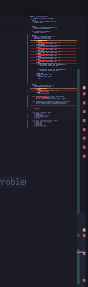
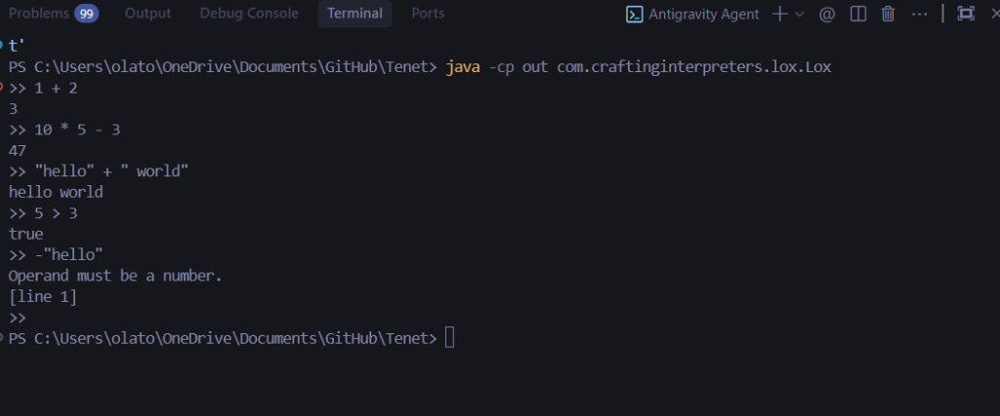

# Tenet Development Screenshots

A visual record of development milestones for the Tenet programming language interpreter.

---

## Chapter 7: Evaluating Expressions

**Date:** December 11, 2025

### Interpreter Code Structure

**Description:** The `Interpreter.java` file showing the implementation of the tree-walk interpreter. Key features visible:
- Visitor pattern implementation (`Expr.Visitor<Object>`)
- `interpret()` method as the main entry point
- `evaluate()` helper for recursive expression evaluation
- `visitBinaryExpr()` with the switch statement for different operators

---

### REPL Demo - Expression Evaluation

**Description:** The Lox REPL (Read-Eval-Print Loop) in action, demonstrating:
- **Arithmetic:** `1 + 2` → `3`, `10 * 5 - 3` → `47`
- **String concatenation:** `"hello" + " world"` → `hello world`
- **Comparisons:** `5 > 3` → `true`
- **Error handling:** `-"hello"` → `Operand must be a number. [line 1]`

This milestone marks the completion of a working expression evaluator!

---

## Milestones Summary

| Chapter | Feature | Date |
|---------|---------|------|
| 4 | Scanner/Lexer | - |
| 5 | AST Generation | - |
| 6 | Parser | - |
| 7 | Expression Interpreter | Dec 11, 2025 |
